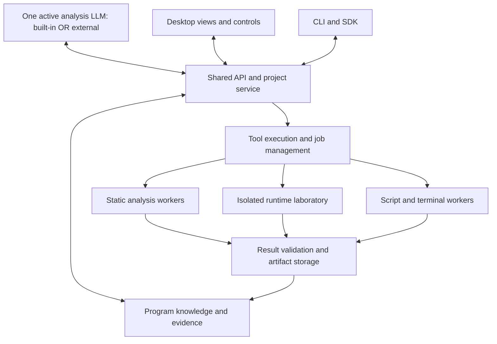

# IndagoRev

**An agentic reverse-engineering workbench for understanding software through natural language.**

IndagoRev will accept a program or a collection of related programs, investigate how they work, and answer questions about their behavior. It will combine established reverse-engineering tools with an AI agent that can navigate code, observe execution, write scripts, run experiments, and validate its findings.

This document describes the planned system at a high level. The [full development plan](C:/Users/Jaden/Desktop/Projects/IndagoRev/kb/IndagoRev_Final_Development_Plan.md) contains the implementation details and milestones.

## Two ways to use it

### Desktop application

An IDA-style workspace will bring together assembly, decompiled code, functions, cross-references, graphs, memory, runtime traces, and a terminal. An integrated chat panel will let the user ask questions and direct an investigation.

The model will have structured access to the same project information and analysis capabilities shown in the interface. Clicking evidence in an answer will open the relevant code or runtime observation. Users can inspect or steer an investigation, while unattended runs can continue without routine intervention.

### CLI and agent API

A CLI, Python SDK, and MCP interface will let external harnesses such as Codex or Claude Code use IndagoRev directly.

In this mode, the external harness's LLM controls the entire investigation and calls IndagoRev's tools. IndagoRev's built-in LLM is inactive. Both interfaces will share the same project state and evidence.

## One LLM, two operating modes

Each investigation has **one active analysis LLM**:

- **Built-in mode:** one local or OpenRouter model runs inside IndagoRev's harness. It plans the analysis, calls tools, interprets results, and answers the user.
- **External mode:** the model in Codex, Claude Code, or another external harness performs those same responsibilities through the CLI/API. IndagoRev provides tools, execution, storage, and evidence without invoking an internal model.

These modes are mutually exclusive for an investigation. There is no additional investigation LLM behind the selected model, and no delegation between external and internal models. The GUI can still display code, jobs, and evidence in external mode; its chat does not start a second model. Switching modes stops the current analysis session before the new owner resumes from saved evidence.

## Architecture



The architecture has five main parts:

| Part | Responsibility |
| --- | --- |
| **Interfaces** | Present the workspace to people and expose tools to other agents. |
| **Selected analysis LLM** | Own the investigation from either the built-in harness or an external harness. Decide what to investigate, select tools, form hypotheses, and interpret results. |
| **Shared service** | Manage projects, tool requests, jobs, resource limits, and access to evidence. |
| **Analysis workers** | Perform static analysis, execute targets, collect observations, and run custom scripts. |
| **Program knowledge** | Preserve discovered behavior, code relationships, experiments, evidence, and unresolved questions. |

Targets are modeled as systems: an executable, its libraries, child processes, services, drivers, and communications can belong to one investigation. Runtime observations are linked to the specific program version and execution that produced them.

The analysis workers and result validator are software tools, not additional LLM agents. They can run multiple tool jobs while the selected LLM remains the sole analysis owner.

## Main tools

IndagoRev will reuse existing engines and add the coordination needed to make them useful to an autonomous agent.

| Area | Tools | Role |
| --- | --- | --- |
| Native code understanding | **XAIR, XAIR_CFG, AIRECE** | Recover instruction semantics, control flow, calls, data dependencies, and compact views suitable for a model. |
| Decompilation | **Ghidra** | Produce pseudocode, types, references, and another view of the program through a headless worker. |
| Symbolic analysis | **XAIR_SYM and Z3** | Answer bounded questions about branch conditions, possible inputs, and data flow. |
| Runtime tracing | **DynamoRIO** | Observe selected execution paths, calls, and memory activity. |
| Debugging and instrumentation | **DbgEng on Windows, a Linux debugger adapter, and selected Frida integration** | Control execution and inspect registers, memory, arguments, and runtime behavior. |
| Strings and capabilities | **FLOSS and capa** | Find decoded strings and recognizable behavior that can guide deeper investigation. |
| Additional formats and runtimes | **LIEF and ILSpy** | Extend executable-format handling and provide .NET analysis when needed. |
| Custom analysis | **Python, native compilers, and a worker terminal** | Let the agent build decoders, process traces, generate test inputs, and compose tools. |

The existing XAIR/AIRECE components are the starting point for native analysis. Their selected versions will be tested together before integration. Ghidra will remain alongside them so the agent can choose the most useful representation and investigate disagreements.

The implemented platform uses **C/C++ for native engines and orchestration**, with one primary native executable and embedded **SQLite plus content-addressed files**. Its current shared boundary is validated JSON. Qt, model integration, protobuf/gRPC and larger trace stores remain future work; older plan references to Python orchestration are superseded by the owner's native-platform direction.

Later capabilities include **rr** for supported Linux replay, **Triton** for selected dynamic symbolic work, and **PANDA, VMI, and hardware trace** for advanced system investigations. These will be added when a demonstrated analysis need justifies them.

## How an investigation works

The central workflow is:

```text
Import → Map the system → Ask or explore → Gather evidence
       → Run an experiment → Validate → Update knowledge → Answer
```

1. **Import the target.** Identify its format, architecture, components, and runtime requirements. Preserve the original files.
2. **Build an initial map.** Recover functions, strings, imports, call relationships, and likely areas of interest using static tools.
3. **Establish the objective.** Answer a user question or autonomously explore interfaces, state, transformations, and observable effects.
4. **Find the missing facts.** Search existing evidence, inspect relevant code, and form testable explanations.
5. **Run targeted experiments.** Execute the program in a prepared environment, trace selected behavior, inspect memory, solve a bounded condition, or write a custom helper.
6. **Validate the result.** Check predictions against execution, test generated artifacts on additional inputs, and resolve conflicting evidence.
7. **Save and explain.** Return an answer with code locations, observations, useful artifacts, and remaining gaps. Preserve the investigation so future questions can build on it.

If execution reveals new code or decrypted data, that material becomes a new artifact and feeds back into static analysis. The agent can repeat this loop as deeper layers of the program become visible.

### Example: configuration decoding

A user asks: **“How does this program decode its configuration, and what do the fields control?”**

IndagoRev locates the configuration-loading path, follows the data through relevant functions, and examines the transformation. If essential values appear only at runtime, it runs a targeted experiment to observe them. The agent can then write a decoder and test whether its output matches the program's behavior.

The result includes an explanation of the fields, the decoder if useful, and links to the code and observations supporting each conclusion. Fields whose purpose remains unclear stay marked as unresolved.

## What makes the agent useful

The model will receive focused views of the evidence relevant to its current question. Tools will handle precise computation, graph traversal, trace processing, and constraint solving. Persistent project knowledge will retain discoveries across long investigations and context resets.

Built-in mode targets practical operation with **one 14–27B local model or one model available through OpenRouter**. External mode uses the external harness's model. Small-model performance will be measured throughout development. A local-only evaluation will use the declared local model without silently falling back to a larger remote model.

The agent will also be able to extend its analysis through scripts and terminal sessions. Those sessions will run in disposable workspaces, and their inputs, outputs, and results will become part of the investigation record.

## Scope and success

Initial support will focus on Windows and Linux x86/x86-64 programs. Support will expand toward managed code, protected binaries, multi-process applications, and user/kernel interactions. Hostile targets will run in isolated laboratory environments with connectivity and resource limits established before an autonomous run begins.

The goal is reliable understanding demonstrated through correct answers and reproducible behavior. The platform will report when evidence, environment access, or tool support is insufficient.

Evaluation will combine **FLARE-On challenges**, **private unfamiliar programs**, and **controlled multi-component systems**. Solving the complete frozen FLARE-On archive with a declared local model is a research target. Private tests will measure whether that capability transfers to software the model has not encountered before.
