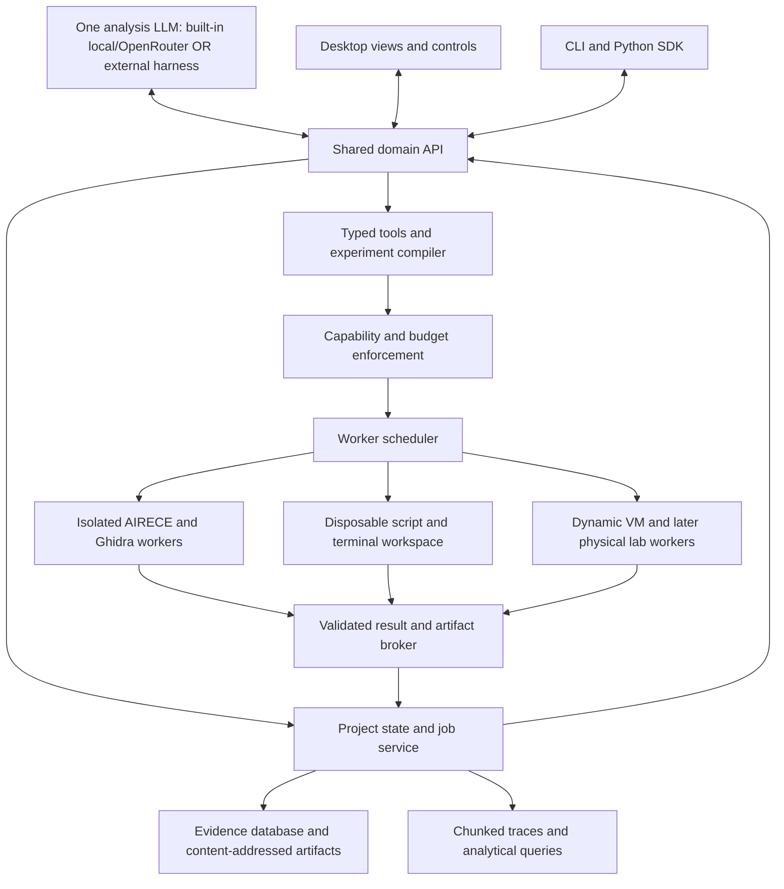

# IndagoRev — Final Development Plan

**Version:** 3.1 · **Date:** September 5, 2026 · **Status:** Implementation baseline — single-LLM ownership clarified

**Purpose:** Build an agentic reverse-engineering workbench that accepts a program or a system of programs, investigates its behavior autonomously, and answers natural-language questions with inspectable evidence. Provide both an IDA-style desktop application with an integrated model harness and a complete CLI/API for external harnesses.

**Implementation status, 2026-09-10:** A fresh two-generation local-Qwen run of
FLARE-On 2014 challenge 3 passed the repaired question-bound gate. Five decoder
stages pass XAIR instruction/control-flow checks and the recovered
`BrokenByte` value reaches its static call sink, so the result is classified as
`verified_transformation`. It can satisfy only a question that explicitly
requires that proof kind; it is not labeled observed output, accepted input, or
an independent grade. Its report therefore has `requirements_verified: true`
and `verified_solve: false`. The
operator-side benchmark verifier supplies the separate
`independently_graded_challenge_solve` proof type. See
[`docs/solve-verification.md`](../docs/solve-verification.md) and
[`docs/flareon-end-to-end-2026-09-08.md`](../docs/flareon-end-to-end-2026-09-08.md).
The private-target, runtime, and full-archive acceptance targets below remain
open.

**Task 2 gate closure:** Checker version 2 additionally verifies original native
initializer stores and exact invoked-buffer identity, full supported decoder-loop
operands/reset/back edges, and publication-time source hashes/revision freshness.
`runtime io-run` now produces bounded native receipts for explicitly trusted PE/ELF
fixtures; accepted-input proofs require an external exact I/O oracle and a
contrasting negative input. This is not a disposable lab or independent challenge
grading. A fresh `BrokenByte` run passed version 2 in 65.302 seconds with 513 native
stores checked, two model generations, and no target execution. See the gate
closure and runtime-receipt sections in `docs/solve-verification.md`.

This document supersedes `Autonomous_RE_Platform_Consolidated_Project_Plan.md` as the development baseline. “Final” means a coherent set of decisions and release gates; research results and measured engineering constraints can change it through recorded architecture decisions.

The intended setting is private, authorized laboratory research: ordinary applications, malware analysis, FLARE-On challenges, and controlled studies of protected user/kernel systems. A laboratory run has its scope, environments, connectivity, and resource allowance established before launch. Within that envelope the agent operates without routine human intervention.

**Navigation:** [Research gap](#2-what-the-paper-establishes-and-what-this-project-must-test) · [Previous plan and local code](#3-review-of-the-previous-plan-and-existing-code) · [Architecture](#5-architecture-and-technology-decisions) · [Autonomous controller](#7-autonomous-investigation-controller) · [Local models](#8-model-providers-and-the-1427b-design-target) · [Evaluation](#15-benchmark-and-evaluation-program) · [Roadmap](#16-delivery-roadmap) · [First-month backlog](#17-first-month-implementation-backlog)

## 1. Executive decision

Build IndagoRev around **persistent program knowledge, an autonomous experiment loop, and strong tool contracts**. Integrate existing analysis engines. Put new engineering into the parts that turn their outputs into reliable understanding.

The main decisions are:

1. **Adopt AIRECE/XAIR as the first native semantic backend**, subject to a reproducible qualification run. The local code is substantially more relevant than the old plan's “reference only” treatment suggests. Keep Ghidra alongside it for mature decompilation and independent perspectives.
2. **Use Ghidra's existing decompiler through a persistent headless worker.** Do not start by extracting or forking its native decompiler core.
3. **Deliver the internal harness and a useful GUI early.** CLI and GUI share one service and evidence store. Neither interface depends on driving the other.
4. **Use exactly one analysis LLM per investigation:** either one local/OpenRouter model in IndagoRev's built-in harness, or the model in an external harness such as Codex or Claude Code. These modes are mutually exclusive. External mode never invokes an internal analysis LLM, and neither mode delegates reasoning to additional model agents.
5. **Allow the model to write scripts, compile analysis helpers, use a terminal, and observe execution.** Provide these abilities in scoped, disposable workspaces with the same evidence and resource accounting as built-in tools.
6. **Test 14–27B local models from the first agent milestone.** Context design, tool reliability, deterministic computation, and persistent state are primary engineering requirements.
7. **Make dynamic analysis part of the first useful autonomous product.** A static-only prototype is a milestone, not proof that the central problem has been solved.
8. **Treat the complete FLARE-On archive as a named research target.** Pair it with private, behaviorally graded programs so success cannot be explained by recognition of public solutions.
9. **Model a TargetSystem from day one.** Grow runtime support from one process to process/service/driver interactions without replacing the data model.
10. **Measure progress against matched baselines.** More integrations or more generated prose do not establish that the research gap is closing.

The long-term aspiration remains: hand the platform an unfamiliar system and let it acquire enough understanding to answer arbitrary relevant questions. The deliverable contract is autonomous, evidence-backed understanding within declared capabilities and budgets. No finite test suite can certify complete semantics for every possible program, input, environment, and external dependency.

## 2. What the paper establishes, and what this project must test

### 2.1 Research source and interpretation

The knowledge base contains **The Next Challenge for Agentic Cybersecurity: A Realistic, Contamination-Free Reverse Engineering Benchmark**, Spence et al., `2608.11469v1.pdf`, dated August 11, 2026. The observations below refer to that supplied version, especially §§1, 3–5, Table 4, Figure 3, and Table 5. These are reported research results, not measurements independently reproduced during this review.

The paper describes SRE-Bench: 19 privately authored programs, approximately 16.9K source lines per program on average, 44 protection primitives, 262 binary instances, and 1,572 deterministically graded tasks. Its strongest evaluated model scores 61.4% and fully solves 80 of **254 gradeable instances**, or 31.5%. The paper excludes ungradeable runs from its averages. Across all 262 scheduled instances, those 80 successes would instead be approximately 30.5%.

The evaluation already supplies substantial tooling: Ghidra/PyGhidra, radare2, GDB, angr, binutils, tracing tools, and domain-specific additions. Agents use a standardized bash-only harness, with up to 500 model steps and six hours per instance. Therefore, the paper does **not** show that installing more reverse-engineering tools is sufficient. It exposes a program-understanding deficit under the tested harness, models, and environments.

Protection causes a major loss: in the matched build comparison, the strongest model drops from 4.69/6 to 2.50/6. Symbol stripping is more costly than optimization or static linking in the reported results. Publicly derived software and small private programs are both much easier than private programs at realistic scale. The authors also acknowledge the limited pool of 19 underlying programs.

### 2.2 Research-to-engineering mapping

| Finding or obstacle | IndagoRev response | Required experiment |
| --- | --- | --- |
| Raw tool availability leaves a large gap | Stable semantic tools, execution recipes, persistent investigation state | Compare bash access to the same engines against the structured interface with the same model and budgets |
| Agents rely heavily on names and lexical clues | Address-linked behavior records, predicates, data dependencies, API effects, and trace evidence | Paired symbolized/stripped targets; misleading-name and decoy-string fixtures |
| Realistic program scale matters | Hierarchical program map, demand-driven slices, subsystem contracts, durable summaries | Increase program and subsystem scale; measure correctness, retrieval misses, and cost |
| Protection blocks access to the real behavior | Runtime code epochs, environment comparison, selective tracing, bounded symbolic experiments | Paired plain/protected private programs, graded by recovered behavior |
| A plausible decompilation is not end-to-end understanding | Runnable decoders, protocol clients, behavioral predictions, and concrete witnesses | Hidden-input execution tests against the original target or an independent oracle |
| Public challenge recognition can inflate results | Separate public regression and private evaluation tracks | No solution retrieval; private programs with independent designs and hidden graders |
| Long investigations lose state or exceed context | Evidence-backed working memory, checkpoints, explicit budgets, loop detection | Forced restart/context compaction and small-context evaluations |
| Deception can produce convincing wrong answers | Competing hypotheses and checks against task-relevant behavior | Controlled decoy-program fixtures; score false confidence as a failure |

These are **engineering hypotheses to validate**, not conclusions established by the paper. In particular, the paper does not prove that a better harness will let a 14B or 27B model solve its hardest instances.

### 2.3 Definition of closing the gap

Use three separate levels of evidence:

- **Harness improvement:** statistically supported gains over a matched baseline with the same model, targets, information, and budget.
- **Useful autonomous RE:** reliable answers and runnable artifacts on private targets across supported languages, protection families, and program scales, without analyst hints during a run.
- **Broad research success:** high complete-instance solve rates on difficult private protected systems, plus the complete frozen FLARE-On archive, using declared local model configurations.

Access to the SRE-Bench instances and graders has not been established; only the paper is present here. Seek access as a later evaluation task. Until then, describe internal testing as **SRE-inspired**, not an SRE-Bench reproduction or score. A private synthetic corpus is an incremental investment, not an instant replacement for the authors' 5,000+ expert hours.

## 3. Review of the previous plan and existing code

### 3.1 Preserve, change, and defer

| Previous-plan element | Decision | Reason |
| --- | --- | --- |
| Shared GUI/CLI project and evidence model | Preserve | Essential to human and agent collaboration |
| TargetSystem and static/runtime identity bridge | Preserve and specify more precisely | Required for runtime encryption, injection, ASLR, and multi-component systems |
| Ghidra headless worker | Preserve | Reuses the mature integration surface and native decompiler |
| Provenance, explicit unknowns, reproducible experiments | Preserve | Foundation for trustworthy answers |
| AIRECE as design reference only | Replace with candidate integration | Local implementation already exposes useful semantic views, flow, slices, and evidence |
| Large new CoreIR with shared executable semantics | Reduce to a thin evidence/relationship contract | Avoid duplicating XAIR and p-code or introducing unsound translations |
| C++ everywhere in the control plane | Use C++ for native engines/GUI; Python for orchestration and experiments | Faster iteration on model adapters and the existing Python benchmark ecosystem |
| PostgreSQL and distributed infrastructure at MVP | Start with SQLite plus local content-addressed storage | Fit a desktop, single-service deployment; introduce server storage when measured needs justify it |
| No arbitrary agent scripts | Replace with a governed script/terminal capability | Novel RE tasks require custom computation and tool composition |
| Planner, runtime, and GUI arrive late | Move the complete question/experiment/validation loop forward | Validate the product's central hypothesis before expanding infrastructure |
| Numeric confidence/fidelity defaults | Use explicit evidence classes and coverage dimensions first | Uncalibrated decimals imply precision the system has not earned |
| Broad tool catalogue | Replace with primary adapters and a measured escalation path | Control integration and maintenance cost |
| Repeated human experiment approvals | Use a preconfigured run envelope | Support genuinely unattended laboratory runs |
| Kernel/VMI/bare metal/DMA | Keep as staged research, with lab gates | These do not belong on the critical path of the first autonomous product |

### 3.2 Local implementation inventory

This review inspected documentation, public headers, dependency files, licenses, and Git identities. It did not build the native components, rerun their benchmarks, or execute any sample. Documentation claims below must be revalidated on the selected integration revision.

| Component | Useful existing surface | Integration decision |
| --- | --- | --- |
| XAIR | PE/ELF loading, Zydis decoding, typed SSA, flags, memory/effects, source provenance, explicit incomplete semantics | Reuse as the native semantic engine; do not build another x86 lifter |
| XAIR_CFG | Functions/blocks/calls, indirect-flow records, graph analyses, completeness, bounded cache operations | Reuse behind a stable worker contract |
| XAIR_SYM | Bounded Z3 solving, taint, sparse state, call models, snapshots, explicit timeout/unknown states | Reuse first for targeted native semantic questions |
| AIRECE | `inspect`, `fn`, `calls`, `xrefs`, `slice`, `path`, `flow`, `taint`, `evidence`; compact/agent/pseudocode/disassembly views | Wrap the current CLI first; use a persistent session worker when profiling warrants it |
| AIRECE evaluation | Paired analyzer/model harness, structured objective scoring, hidden behavioral reconstruction tests | Extend the harness and preserve baseline results |

The inspected checkout identities were:

| Repository | HEAD at review |
| --- | --- |
| XAIR | `02c37b05348ac32a1019d4947e57964a2024ac9f` |
| XAIR_CFG | `aea66d728ff824f09455e4c5447e210247a22a0a` |
| XAIR_SYM | `e545ea94f092eae9f03c9e7f3cc79f58d7f0c469` |
| AIRECE | `23997f2e7430baff1d4d5e087e4e1bda786c45f0` |

Each component checkout reported clean status. The IndagoRev parent directory itself was not a Git repository at review.

**Concrete foundation issue:** `AIRECE/BENCHMARK_FREEZE.md` lists XAIR_CFG pin `cad38e5822829f466da141ca11101b72ae4013f3`, while `AIRECE/cmake/DependencyPins.cmake` lists `e9a0b0674f0710c4d372dff48fc1b1b6041e65a9`. The current component HEADs also differ from the recorded pins. Resolve the intended composition, build it in an isolated integration checkout, and produce one authoritative lock record. Do not disable pin checks and call that a qualified build. The frozen benchmark tag, current documentation, and current checkout are different identities until demonstrated otherwise.

XAIR readiness documentation distinguishes continued-development readiness from production qualification and records remaining qualification evidence gates. Preserve that distinction. Public headers and tests are useful evidence of implemented contracts; they do not establish complete instruction coverage or real-malware readiness.

The AIRECE README reports a small local 27B experiment using a Q1_0 quantization and nine held-out cases per model, including a native-objective advantage over Ghidra and weaker reconstruction results in that tier. Treat it as motivation for preserving multiple views, not a general result about 27B models or FLARE-On. Rerun with controlled quantization, output validation, and enough independent programs.

Local license headers identify Jaden Bowers and reserve rights. This plan assumes the project owner can authorize integration of their own originals; record that ownership/grant with the dependency manifest. Do not impose a fictional third-party permission obstacle on owner-controlled code. Third-party components and redistribution still need their actual notices and terms recorded. The planning work does not require relicensing these repositories.

## 4. Product requirements and acceptance contract

### 4.1 What “understand the program” means

IndagoRev maintains a **behavioral model with evidence and gaps**, containing:

- Program/system inventory; entry points; interfaces; dependencies; data stores; runtime prerequisites.
- Function and subsystem roles, inputs/outputs, state transitions, and cross-component contracts.
- Relevant algorithms, transformations, checks, error paths, and side effects.
- Runtime observations linked to original or derived code versions.
- Executable predictions or analysis artifacts where useful: decoders, parsers, test inputs, state-machine drivers, or behavioral reproductions.
- Explicit unknowns, contradictory hypotheses, missing environments, and unobserved paths.

Understanding is demonstrated by answering unseen questions and predicting or reproducing behavior on held-out inputs. Renaming every function, recovering original source, or producing a long report is not required for every question.

Two workflows are first-class:

1. **Explore:** ingest a target and autonomously build a system dossier without requiring the user to identify functions or supply a reversing strategy. Use a default objective covering interfaces, state, important data transformations, and observable effects. Stop at a declared coverage/budget boundary.
2. **Ask:** answer a specific natural-language question using existing evidence, acquire missing facts, and validate the answer. The question can reveal gaps that an earlier exploration did not cover.

A completed exploration means the declared investigation completed. It does not mean every possible behavior is known.

### 4.2 Requirements traceability

| ID | Requirement | First delivery | Acceptance evidence |
| --- | --- | --- | --- |
| R01 | Import a binary, directory, or explicit system manifest | M1 | Stable inventory, bounded recursive extraction, linked artifacts |
| R02 | Autonomous explore and natural-language ask | M2; runtime completion M3 | No manually supplied addresses or routine analyst interventions |
| R03 | IDA-style code workspace plus integrated chat | M2 | Evidence links synchronize pseudocode, assembly, graph, and chat |
| R04 | CLI/SDK/MCP for external agents | M1–M2 | Direct tools work without an internal model or GUI |
| R05 | OpenRouter and local model harness | M2 | Capability probes, pinned configurations, restartable transcripts |
| R06 | Agent scripts, terminal, and helper compilation | M2; target execution M3 | Inputs, outputs, source, logs, and resource use preserved |
| R07 | Runtime evidence and recovered code feedback | M3 | Generated/decrypted code reingested with valid time-scoped identity |
| R08 | Bounded flow, symbolic solving, behavioral validation | M1 primitives; M4 advanced | Concrete witness checks; no promotion of unknown to proof |
| R09 | Protected/native/managed challenge coverage | M4–M5 | Published capability matrix and complete failure accounting |
| R10 | Cross-process and user/kernel understanding | M6 | Seeded causal chain recovered with observed buffer/request evidence |
| R11 | 14–27B local model operation | M2 onward | Local-only runs; no hidden larger-model fallback |
| R12 | Solve the complete frozen FLARE-On archive | M5 research track onward | Every catalogued challenge verified under the declared model/budget |
| R13 | No routine human intervention after launch | M2 onward | Intervention count zero; automatic bounded recovery and honest terminal states |
| R14 | Evidence quality, containment, resumability | M0 onward | Contract, crash/restart, isolation, and answer-validation gates |
| R15 | Exactly one analysis LLM owns each investigation | M1–M2 | External mode makes zero internal model calls; built-in mode has one model owner; competing ownership and nested-model requests are rejected |

### 4.3 Supported targets are a matrix

Track **host platform, target format, ISA, ABI, language/runtime, target OS/build, analysis operation, and protection behavior separately**.

- First native scope: PE32/PE32+ and ELF32/ELF64, x86/x86-64; Windows desktop development and a Linux test worker.
- Early execution scope: explicitly qualified Windows and Linux user-space images; compatibility failures remain visible.
- Next scope: .NET and challenge-specific scripts/bytecode, embedded payloads, Go/Rust runtime idioms, exception-driven behavior, runtime-generated code.
- Later scope: ARM/AArch64, firmware/peripheral models, additional formats and runtimes according to benchmark inventory.
- Research scope: protected drivers, whole-system behavior, novel virtual machines, environment-sensitive commercial systems, and physical-lab observations.

Accepting an unsupported file is still useful: identify and preserve it, state the missing capability, and retain it as a component of the system. Never equate “Ghidra can decode this ISA” with full dynamic/symbolic support.

## 5. Architecture and technology decisions

### 5.1 Shared service, separate execution environments



The service is the sole project-state writer. Each investigation has one selected analysis owner: either the built-in model harness or an external model harness. Both use the same tool operations, but only one owns a given investigation at a time. In external mode the built-in inference loop is inactive; all planning, interpretation, and answer composition belong to the external LLM. Workers, scheduling, context retrieval, and result validation are ordinary software, not additional LLM agents. Worker crashes must not crash the desktop or corrupt the project.

Store the ownership mode and session identity with the investigation. Reject a second active owner and reject attempts to launch an internal LLM from an externally owned investigation. Switching modes requires stopping the current reasoning session, settling or cancelling its outstanding actions, and transferring the saved state to the new owner. The GUI and CLI remain available for inspection and ordinary user controls in either mode.

### 5.2 Initial stack

| Area | Choice | Boundary and rationale |
| --- | --- | --- |
| Native semantics | Existing C/C++ XAIR/AIRECE; CMake composition lock | Native worker; preserve upstream component repositories |
| Decompilation | Ghidra headless Java adapter around `DecompInterface` | Persistent per-project worker with bounded lifetime and cache invalidation |
| Controller/CLI/SDK | Python | Job state machine, model adapters, recipes, benchmark harness; move hot paths only after profiling |
| Desktop | C++20 and Qt 6 Widgets | Docking, virtualized models, shared API; no target parsing in GUI |
| Domain/worker API | Versioned protobuf/gRPC plus documented JSON representation | One contract; narrow MCP adapter; no duplicate REST stack in the first release |
| Metadata | SQLite in WAL mode, owned by one service | Local desktop first; migration-ready schema, no direct worker database access |
| Artifacts | Local content-addressed files and manifests | Hash originals, outputs, models of state, and trace chunks |
| Traces | Bounded columnar chunks; Parquet and DuckDB analytics as volume grows | Query selected events instead of putting raw traces in model context |
| Primary native instrumentation | DynamoRIO | Implement one scoped client for qualified user-space profiles |
| Debug control | Windows DbgEng adapter; Linux debugger adapter | Breakpoints, registers, memory, execution state, diagnostics |
| Scripted instrumentation | Frida adapter when needed by a recipe | Keep attached instrumentation distinct from lower-footprint observation |
| Native symbolic work | XAIR_SYM/Z3 first | Triton for concrete-seeded dynamic work when a measured gap requires it |
| Replay | rr for qualified Linux workloads; PANDA pilot later | Separate capabilities, never generic replay for all platforms |
| Enrichment | Selected capa/FLOSS workers; LIEF for format needs beyond current loaders | Discovery hints; preserve tool limitations and provenance |
| Managed analysis | ILSpy command-line/library worker for .NET | Match runtime and metadata identities rather than force everything through x86 IR |

Ghidra's documented interface provides persistent function decompilation, structured results, failure reporting, and cache controls. The proposed worker builds on that surface. [Ghidra decompiler API](https://ghidra.re/ghidra_docs/api/ghidra/app/decompiler/DecompInterface.html)

Qt supplies dockable widgets suitable for the intended layout. SQLite is appropriate for an application-local database; a network-shared multi-writer database is a different deployment. The single-service ownership rule is an IndagoRev design decision. [Qt docking](https://doc.qt.io/qt-6/qdockwidget.html), [SQLite deployment guidance](https://sqlite.org/whentouse.html)

### 5.3 Integrate selectively

DynamoRIO, Frida, and DbgEng supply different instrumentation/debugging surfaces. They are candidates for tested adapters, not interchangeable assurances of transparency. [DynamoRIO](https://dynamorio.org/), [Frida](https://frida.re/docs/home/), [DbgEng](https://learn.microsoft.com/en-us/windows-hardware/drivers/debugger/debugger-engine-overview)

Use existing enrichment and managed-code analysis when the target calls for them. A capability signature is a lead, a recovered string is evidence of bytes under a method, and decompiled managed code still needs behavioral validation. [capa](https://github.com/mandiant/capa), [FLOSS](https://github.com/mandiant/flare-floss), [ILSpy](https://github.com/icsharpcode/ILSpy), [LIEF](https://lief.re/)

Defer a graph database, vector database, distributed message bus, cloud tenancy, public plugin marketplace, custom hypervisor, and universal IR translator. Introduce PostgreSQL only when concurrent users, remote operation, or measured write/query contention require it. Do not maintain two production database implementations during the MVP.

### 5.4 Backend qualifications

A capability descriptor includes exact tool/image version, target matrix, input/output schema, semantics limitations, required privileges, cancellation support, resource ceiling, and qualification report identity. The scheduler selects **qualified operation/profile combinations**, not an entire tool on the strength of its README.

Adapters must preserve complete/partial/error distinctions, standardize address representations, reject stale identities, enforce output bounds, and retain raw exports. Qualification includes malformed input, hangs, large outputs, unsupported instructions, architecture mismatch, and worker termination.

Use process boundaries for fault containment and independent maintenance. Record actual licensing/packaging obligations per pinned dependency; a sidecar boundary is not treated as an automatic licensing exemption.

## 6. Program knowledge, identity, and evidence

### 6.1 Essential entities

| Entity | Required information |
| --- | --- |
| Project / TargetSystem | Scope, component inventory, objectives, capability envelope, dependencies |
| Artifact / DerivedArtifact | Content hash, format, size, provenance, extraction/capture lineage |
| AnalysisRevision | Input hash, tool/configuration digests, annotations, schemas, result identities |
| StaticEntity | Function/block/instruction/data/type identity, address space, original bytes, recovery method |
| BehaviorContract | Inputs, outputs, guards, state updates, side effects, dependencies, cited facts |
| Run / ObservationContext | Inputs, environment image, OS/build, observers, clocks, event loss, termination |
| Process / Thread / ModuleInstance | Creation/lifetime identity, mappings, module version, parent links |
| CodeEpoch | Address range, bytes hash, observation interval, capture coverage, derivation |
| IPC / UserKernelInteraction | Endpoint/object identity, request/response data, mechanism, causal evidence |
| Evidence / Claim | Producer, source locations, assumptions, scope, support class, dependencies |
| Hypothesis / Question | Required facts, alternative explanations, predicted observations, unresolved gaps |
| Experiment / Job | Manifest, capability grant, resource budget, execution history, results |
| ScriptArtifact / Validation | Source and input hashes, toolchain, generated files, tests, witness results |

### 6.2 Identity rules

Static locations use an artifact hash, address-space identity, and RVA or format-appropriate offset. Function boundaries can change after improved analysis; make their discovery identities revision-scoped and map old/new entities explicitly. A function name is an annotation, never an identity.

Runtime addresses require **run + address space + process lifetime + module load lifetime + address + code epoch**. PIDs, module bases, and virtual addresses can all be reused. ASLR normalization alone is insufficient. Kernel mappings have their own lifetime and build identities.

For self-modifying, JIT, unpacked, or transiently decrypted code, preserve each observed byte version and its valid interval. Never merge pages collected at incompatible times into an allegedly faithful executable image. Incomplete capture remains a set of partial regions. Link reconstructed files to the original captured bytes and document synthesized headers or imports.

Represent 64-bit addresses in JSON as explicit hexadecimal strings; binary records can use fixed-width integer fields. Avoid loss through floating-point JSON consumers. Every address conversion is checked for width, endianness, address space, load interval, and file mapping.

### 6.3 Thin semantic interchange

Own the common vocabulary for locations, calls, guards, reads/writes, def/use edges, state effects, and evidence. Preserve native XAIR modules, Ghidra p-code, managed metadata, and solver artifacts as versioned backend outputs.

Do not initially require a universal executable CoreIR. Shared queries can traverse normalized relationships while a selected engine performs semantic work in its own IR. Any cross-IR conversion must declare unsupported operations and validate the subset it translates. Exceptions, atomics, floating point, flags, and external calls cannot disappear during conversion.

Ghidra and XAIR disagreements are retained. Select a preferred view for presentation using qualified coverage and task needs, while showing conflicts that affect the answer. Agreement between related pipelines does not count as independent confirmation of their shared lifter.

### 6.4 Claims and uncertainty

Use explicit states: `observed`, `derived`, `validated`, `inferred`, `contradicted`, and `unknown`. These classify evidence; they are not a universal ordering of truth. A runtime observation may be exact for one run but irrelevant to another environment.

Every substantive claim includes:

- Subject, predicate/value, evidence IDs, original locations, and producer revision.
- Scope: target build, code epoch, inputs, run/environment, and relevant preconditions.
- Assumptions, missing regions, approximations, and dependencies on earlier claims.
- Validation result, counterevidence, and the remaining fact that would change the conclusion.

Citation existence is checked mechanically. Citation **entailment** still requires semantic checks or an independent behavioral test; a citation-shaped answer is not sufficient. Backend qualification does not justify an arbitrary confidence percentage. Add calibrated probabilities only after enough labeled data exists for the relevant claim category.

“No observed call” requires adequate trace coverage and remains scoped to the observed execution. Solver `unsat` applies to the encoded region, model, and bounds. `timeout`, `unknown`, and unsupported semantics are never presented as unreachability proofs. Taint denotes a dependency under its policy, not automatically exploitable influence.

### 6.5 Persistence and invalidation

Store immutable raw outputs, derived evidence, append-only job events, and editable annotations separately. Summaries contain dependency IDs; changing bytes, symbols, assumptions, tool versions, or analysis options invalidates affected summaries and downstream claims. Preserve prior revisions for audit and comparison.

Use transactional metadata publication with staged artifact writes, hash verification, and atomic finalization. On recovery, incomplete artifacts remain unpublished. Garbage collection follows references and retention policy; evidence cited by a retained conclusion cannot silently lose its source.

Index exact facts, names, constants, source locations, calls, and typed edges first. Semantic search is an optional retrieval aid. Store library identification separately from application behavior, and keep a path back into a library when the question requires it.

## 7. Autonomous investigation controller

This section describes the loop run by the **single selected analysis LLM**. IndagoRev implements the model loop only in built-in mode. In external mode, Codex, Claude Code, or another harness owns that loop; IndagoRev exposes the same evidence, deterministic tools, job controls, and persistence without running a parallel internal planner or answer model.

### 7.1 State machine

An investigation follows:

```text
ingest -> establish target/environment -> build initial map
  -> decompose objective into required facts
  -> retrieve existing evidence
  -> identify gaps and competing hypotheses
  -> choose bounded action or experiment
  -> execute -> normalize -> validate -> update knowledge
  -> repeat until the objective is supported or a terminal condition applies
```

The LLM selects hypotheses and proposes actions. Deterministic code validates arguments, identities, budgets, prerequisites, and grants; schedules jobs; checks result contracts; and tracks termination. Do not ask the LLM to implement address arithmetic, graph traversal, bit-vector evaluation, trace aggregation, or bookkeeping in prose.

Start with a small set of maintained recipes: configuration/data decoding, input-validation logic, file-format recovery, API-effect explanation, state-machine reconstruction, runtime-code recovery, and component interaction. A recipe provides scaffolding and validation obligations, not a fixed sequence of manually chosen addresses. The planner can compose primitives or create a helper when the recipe does not fit.

### 7.2 Planning record

Maintain a compact investigation board with the current objective, required facts, known evidence, hypotheses, failed approaches, promising next actions, remaining budgets, and stop conditions. Each action proposal states:

1. The gap it addresses.
2. The evidence expected from success.
3. A falsifiable prediction where applicable.
4. Its required backend/environment and estimated cost.
5. The next action if the result is absent, partial, or contradictory.

Select actions using a simple, inspectable heuristic first: relevance to required facts, likelihood of informative output based on observed history, available capabilities, cost, and fidelity. Do not invent precise information-gain scores before empirical calibration.

### 7.3 Small-model context design

The context service produces bounded evidence packets containing the question, current hypothesis, selected behavior records, critical predicates/constants, the relevant call or dataflow neighborhood, exact evidence references, and explicit omissions.

Offer progressive levels: system overview, subsystem contract, function digest, pseudocode, assembly, native IR, and raw bytes. The agent can always drill down. The default packet must retain guards, side effects, unknown calls, signedness/width, and competing interpretations that change the answer.

Do not dump a whole decompilation project or trace into context. Start model qualification with 16K and 32K context configurations where supported. Reserve space for output and diagnostics; a reasonable initial allocation is 20% instructions/tool contracts, 20% investigation state, 40% selected evidence, and 20% output reserve. Measure and adjust it per model/tokenizer.

A short navigation surface discovers additional tools by task family. Keep uncommon tool schemas out of every prompt. Structured-output validity and navigation accuracy are evaluated separately from semantic accuracy.

### 7.4 Durable memory and recovery

After every completed action, commit the result and update the investigation board. Context compaction rebuilds state from evidence and decisions, with exact IDs, rather than trusting a lossy chat summary. A restarted controller must resume a queued/active investigation without repeating completed side effects.

Pure analyses are cached by all semantics-affecting inputs. Dynamic experiments create new runs even when parameters match. Use idempotency keys for submission, leased jobs, heartbeat expiry, retry classification, and a distinction between “worker lost” and “target completed.” Cancellation must reach child processes and release environment leases.

Bound recovery: at most two attempts to repair an invalid tool argument or output structure, followed by a different action or an explicit failure. Track repeated action/input pairs and repeated hypotheses. After three unproductive cycles, change strategy or conclude with the unresolved gap; do not consume the entire budget in an unchanged loop.

### 7.5 Validation and termination

The validator is deterministic software that checks source mapping, evidence scope, result completeness, and available task-specific behavioral checks. The selected LLM can reconsider its own interpretation and contradictions, but no separate critic or validation LLM is introduced. Concrete tests, independent observations, and narrowly scoped solver evidence carry the validation burden.

Terminal states are `answered`, `partial`, `budget_exhausted`, `unsupported`, `environment_unavailable`, `contradictory`, `capability_blocked`, `failed`, and `cancelled`. A no-intervention run can terminate in any of these states; only a verified correct result counts as a solve.

The result includes the answer, evidence-backed claims, generated artifacts, uncovered scope, failed experiments, total resource use, and a reproducibility manifest. An unattended run that cannot obtain necessary server-side material or a representative environment reports that dependency instead of fabricating behavior.

## 8. Model providers and the 14–27B design target

### 8.1 One adapter contract

Implement a provider adapter for streamed completion, tool calls, structured output, context/token accounting, cancellation, error classification, and generation metadata. Support OpenRouter and a local server first. A compatible HTTP endpoint alone does not establish reliable tool calling.

Before use, run small capability probes for tool argument fidelity, nested schemas, tool-result continuation, multi-step calls, truncation behavior, and context limits. Preserve the exact model identifier, weight revision when available, quantization, tokenizer/chat template, serving engine version, sampling settings, tool schema version, and prompt hash.

OpenRouter supports client-executed tool calling and provider routing controls. Configure required parameters, explicit provider choices where needed, and declared fallback behavior. Keep API keys in the controller and record which provider actually served each generation. [OpenRouter tool calling](https://openrouter.ai/docs/guides/features/tool-calling), [provider routing](https://openrouter.ai/docs/guides/routing/provider-selection)

For local inference, start with llama.cpp where it fits the available hardware and model. Its tool support depends on model/template configuration, so pin and probe the configuration. Other serving engines can implement the same adapter after qualification. [llama.cpp function calling](https://github.com/ggml-org/llama.cpp/blob/master/docs/function-calling.md)

### 8.2 Local model evaluation contract

Qualify at least one model near 14B and one near 27B, selected by measured performance rather than parameter count alone. Record dense versus mixture-of-experts architecture and both total and active parameters where relevant. Use a practical baseline quantization such as 4-bit, then compare a higher-precision configuration on a diagnostic subset. The existing AIRECE Q1_0 result is a separate configuration, not the default quality expectation.

A **local-only** run uses no remote completion, remote embedding, larger-model rescue, or precomputed target-specific solution. All reasoning belongs to the single declared local model; helper programs are ordinary software tools. Separately label runs using a single cloud model. External-harness mode records the caller's model declaration when available and does not claim local-only compliance when it cannot verify it.

Choose one model configuration for the investigation. Do not add specialist LLM roles, a second planner, a critic model, or automatic cross-model rescue. Parallel execution applies to software tool jobs only. Provider routing, if used for availability, must preserve the selected model and declared run policy; changing the model requires stopping the current session and recording an explicit ownership/configuration change.

Record model tokens, model time, tool time, peak CPU/RAM/VRAM, solver effort, and trace storage. Local inference has resource cost even without an API charge. Hardware sizing is a Phase 0 measurement, including model weights, KV cache, runtime overhead, and concurrent analysis; do not purchase the advanced lab based solely on model parameter count.

### 8.3 Data flow

Local-only mode keeps model inputs and derived context local. A cloud-enabled project declares which extracted data may leave the lab. The controller applies that policy before sending context and never forwards worker credentials. Benchmark evaluation projects have solution retrieval and external search disabled.

## 9. Scripting, terminal, and model extension of the tools

### 9.1 Capabilities the agent receives

The harness exposes file read/write in a job workspace, Python execution, native-helper compilation, process/terminal sessions, structured debugging, and artifact publication. The model can implement a decoder, evaluate a custom algorithm, correlate traces, generate controlled test inputs, or assemble a reproducible experiment.

Use two workspace profiles:

- **Analysis helper:** selected evidence/artifacts and data-processing tools; no controller secrets, host mounts, or privileged management endpoints.
- **Target experiment:** an allocated disposable environment with target execution/debugging and the approved laboratory connectivity.

Both receive the same scoped SDK for evidence lookup and artifact publication. The agent can invoke unfamiliar command-line tools inside its workspace when installed and permitted. Lack of a polished high-level adapter must not force manual intervention for an otherwise supported contained experiment.

### 9.2 Execution contract

Every script/tool process records source or command text, working directory, input IDs, environment/toolchain versions, stdout/stderr, exit status, outputs, and resource limits. Prefer argument arrays; when an interactive shell is needed, keep its interpretation inside the worker, log the session, and expose bounded reads, input, interrupt, and close operations.

Scripts can publish **candidate** evidence. Only the broker/service can admit results after schema, identity, and provenance checks. Generated helpers are untrusted code and execute in disposable workers. They cannot mutate planner code, permissions, evaluation graders, the shared evidence database, or pinned dependencies.

Select preinstalled tool images by capability. Dependency additions use a controlled image-building workflow, with versions recorded and subsequent runs using the resulting image. The model cannot silently install arbitrary software into the controller during an investigation.

### 9.3 From successful helper to reusable capability

When a helper solves a repeated problem, preserve its source, example inputs, expected outputs, applicability constraints, and validation history. Promote it into a maintained recipe only after regression testing on independent fixtures. Test-specific constants and hardcoded flags never become general capabilities. Future model fine-tuning may use training-split trajectories, with held-out programs and secrets excluded.

## 10. Desktop application

The GUI uses a familiar reversing layout:

```text
┌──────────────────── Project / target / run / global search ───────────────────┐
│ Components, functions │ Pseudocode | Assembly | CFG │ Chat and investigation │
│ Imports, strings      │ Synchronized address view   │ Plan, tools, evidence  │
│ Types, artifacts      │                             │ Gaps and conclusions   │
├───────────────────────┴─────────────────────────────┴────────────────────────┤
│ Runtime timeline | Memory/registers | Terminal/scripts | Jobs and diagnostics │
└───────────────────────────────────────────────────────────────────────────────┘
```

M2 delivers docking, functions/imports/strings, pseudocode, assembly, a bounded CFG view, cross-references, annotations, search, chat, and a script/terminal pane. M3 adds the live/debugger state, memory/registers, process/module timeline, and trace overlays. Later work adds network, kernel topology, cross-run comparison, and broader graph navigation.

Selecting an answer citation navigates to the actual instruction, decompiler token range, trace event, or artifact region. Selecting code can attach its identity and a bounded evidence packet to chat. The model reads structured selection and project state; screenshot interpretation is optional for genuinely visual targets, not the primary code interface.

Renames, comments, and type edits are versioned annotations with author/origin and affected analysis revision. GUI and agents observe the same updates through an event stream with sequence numbers and reconnect/resume support. Conflicting edits use optimistic revision checks.

Keep the UI responsive through paging, virtualized tables, bounded graph neighborhoods, background layout, and cancellation. Do not load an entire large trace or call graph into a widget. Display analysis limitations beside the relevant view. The user can pause, inspect, steer, or take over; none of these interactions is necessary for an autonomous benchmark run.

## 11. CLI, SDK, and external-harness interface

### 11.1 External ownership and built-in ownership

**External mode** exposes deterministic analysis, state inspection, experiments, terminal access, and evidence. The external harness's LLM owns the entire loop. IndagoRev does not invoke its built-in model. **Built-in mode** exposes `ask` and `explore` to users through the GUI or CLI, using one configured local/OpenRouter model. Both modes use identical evidence and action contracts, but their LLM ownership is mutually exclusive. An external agent cannot delegate a subtask to a second internal LLM.

The `ask` and `explore` examples below apply only to built-in mode. An externally owned investigation rejects those model-starting operations with an ownership conflict. Deterministic tools remain available in either mode. In external mode the GUI displays the shared evidence and job state without starting its own chat model.

The command examples below specify the proposed interface; these commands are not implemented by this planning deliverable.

```text
indago project create --name demo --json
indago target import --project demo --manifest target-system.json --json
indago analyze --project demo --profile static-balanced --json
indago explore --project demo --model-profile local-27b --budget standard --json
indago ask --project demo --question "How is the configuration decoded?" --json
indago entity show --project demo --id fn_123 --view agent --json
indago action run --project demo --request experiment.json --json
indago job events --project demo --id job_123 --follow --jsonl
indago job cancel --project demo --id job_123 --json
indago evidence show --project demo --id ev_123 --json
indago export --project demo --format investigation-bundle --output bundle-dir
indago mcp serve --project demo
```

### 11.2 Common action/result contract

An action names its tool/schema version, project/target revision, entity or artifact inputs, environment if needed, capability envelope, idempotency key, resource budget, and expected result type. For example:

```json
{
  "schema": "indago.action.v1",
  "tool": "function.analyze",
  "project_id": "prj_demo",
  "analysis_revision": "rev_12",
  "inputs": {"entity_id": "fn_123", "views": ["agent", "pseudocode"]},
  "capability_envelope_id": "cap_static",
  "idempotency_key": "demo-function-123-revision-12",
  "budget": {"wall_ms": 30000, "memory_bytes": 1073741824, "output_bytes": 65536}
}
```

All responses expose schema version, request/job ID, status, result revision, bounded data, evidence IDs, diagnostics, completeness, omitted fields/counts, and a continuation cursor when relevant. Completion and scientific verdict are separate: a job may complete successfully and conclude `unknown`.

Long jobs return immediately with a durable ID. Status, event streaming, cancellation, retry, and result retrieval are independent operations. stdout carries only the requested JSON/JSONL protocol; diagnostics go to stderr. Pin stable sorting where meaningful, schema compatibility rules, machine-readable error codes, and documented exit codes. Preserve an explicit partial-result exit code, following AIRECE's existing distinction where practical.

### 11.3 MCP and tool discovery

Expose a small initial set: project/target operations, capability discovery, entity/search, graph/flow query, action submission, job control, evidence/artifact retrieval, and workspace/terminal operations. The external-agent surface does not expose delegation to an internal LLM. Paginate large resources and discover specialist schemas on demand.

MCP is a transport adapter, not a second business-logic implementation. Preserve tool error distinctions and structured content. Pin a supported protocol version and run compatibility tests against the chosen external clients. [MCP tool specification](https://modelcontextprotocol.io/specification/2025-06-18/server/tools)

External agents have project-scoped credentials and the same action ceilings as the GUI harness. Separate authentication from target contents. No generated text or embedded artifact instruction can grant a new capability.

## 12. Static, dynamic, and behavioral analysis pipeline

### 12.1 Static analysis

Ingest files with bounded archive expansion, path traversal rejection, decompression limits, and content hashes. Parse hostile formats in workers. Detect native versus managed/script content before selecting analysis. Preserve extracted children and the parent/container relationship.

For native targets, run AIRECE's inexpensive inventory and selected semantic views, import into Ghidra, and merge **references to evidence**, not competing guesses into a single unquestioned result. Export pseudocode tokens with address mappings, variables/types, calls, cross-references, CFGs, native IR references, and diagnostics. Analyze functions lazily after initial inventory, with bounded background work for exploration.

Pay particular attention to indirect calls, jump tables, virtual dispatch, callbacks, exceptions, TLS initialization, calling conventions, and compiler-generated code. Confidence in a function summary must reflect unresolved control flow and external-call models. Add Go/Rust runtime recognition and .NET analysis as separate adapters and knowledge, not cosmetic pseudocode renaming.

### 12.2 First dynamic release

Implement the minimum useful experiment set:

- Launch with controlled arguments, input files, environment, working directory, time limits, and child-process tracking.
- Capture process/thread/module lifetimes, file/configuration/network effects, selected API calls, and coverage where available.
- Set scoped breakpoints or trace points; inspect registers, selected memory, call arguments/returns, exceptions, and crash state.
- Script a sequence of inputs or UI/console interactions where the target requires them.
- Capture runtime-produced code/data, reingest it, and relate new findings to the originating run.

Start with broad, inexpensive telemetry, then select the functions or memory regions required by the question. Instrumentation cost, dropped records, missing events, and observer failure are explicit fields. An observer process staying alive does not establish a complete trace.

Normalize each event with a per-producer sequence number, timestamp/time domain, process/thread lifetime, module/code epoch, source location, and capture method. Across producers or machines, record clock uncertainty. Global timestamp sorting is a presentation aid, not proof of causal order.

### 12.3 Runtime recovery and reinvestigation

Runtime recovery is a loop: identify a relevant code/data region, capture its observed version, register a derived artifact, analyze it, and use the new information to design the next experiment. Recovered strings, configuration, or memory pages may be enough to answer a question without reconstructing a runnable whole image.

Support write/execute transitions, manually mapped modules, child/injected code, JIT code, and partial page residency through the same lineage model. Imports and headers reconstructed from observations are marked synthesized and validated separately. A process exit after attaching an observer is an experiment result, not proof that the program has no payload.

### 12.4 Replay and repeatability

Add rr for supported Linux recordings before committing to whole-system replay. PANDA provides a whole-system analysis and replay foundation, but its tested machine/OS configurations must be qualified separately. [rr](https://rr-project.org/), [PANDA](https://github.com/panda-re/panda)

The replay adapter records the required environment, determinism limitations, trace/checkpoint identities, and whether the target event was reproduced. GPU work, external services, hardware behavior, and timing-sensitive multi-threading can defeat straightforward replay. Repeated controlled executions with explicit variation remain a valid alternative when deterministic replay is unavailable.

### 12.5 Behavioral work products

An answer may require an artifact rather than prose. Support:

- Decoder/parser reconstruction checked against unseen files, including malformed/boundary cases.
- Protocol state-machine hypotheses and clients checked against an isolated test service.
- Recovery of input conditions and test inputs that exercise predicted branches.
- A behavioral model of side effects with preservation checks for unrelated state.
- Reimplementation of a selected algorithm, checked for widths, signedness, state, error handling, and exact bytes.

The model uses the terminal/toolchain to implement these products, then tests them in workers. Behavioral similarity on a finite sample is labeled as tested equivalence over that sample. It is not promoted to complete program equivalence.

## 13. Symbolic analysis, protection, and system-level research

### 13.1 Bounded symbolic and taint work

Use AIRECE/XAIR_SYM's existing source/sink selectors and result distinctions. Establish a concrete question, narrow its slice, define relevant input bytes and external-call assumptions, then solve within state/query/time/memory limits. Concrete runtime state can seed targeted analysis once mapping between captured state and the backend is qualified.

A solver witness must be replayed against the original unmodified target or a clearly scoped oracle when feasible. Preserve the exact encoded conditions and report failures of the execution model. Do not delete the incompatible evidence and retain only a successful solver message.

Triton is an optional dynamic semantic engine when concrete-seeded execution or a capability missing from XAIR_SYM is required. Qualify its contribution rather than maintaining two full symbolic stacks by default. [Triton](https://github.com/JonathanSalwan/Triton)

Prioritize integer/string transformations, table lookup, bounded loops, input checks, small protocol states, and selected source-to-sink flows. Whole-program symbolic execution and unrestricted cross-system taint are outside the default plan.

### 13.2 Protection analysis as a measured research track

Protection handling aims to recover task-relevant behavior in a controlled lab. It does not promise an invisible debugger or generic defeat of every protection scheme.

| Obstacle | Required platform capability | Validation |
| --- | --- | --- |
| Misleading strings and fake functionality | Alternative hypotheses linked to observed effects | Decoy fixtures; distinguish real task behavior from plausible labels |
| Flattened/indirect control flow | Bounded graph/semantic analysis and trace-guided path evidence | Predicted transitions on hidden inputs |
| Runtime encryption and partial residency | Time-scoped code/data capture and reinvestigation | Correct attribution without treating partial pages as a full image |
| Anti-debugging or environment sensitivity | Baseline/observer comparison and divergence records | Detect seeded observer-dependent outcomes and limit their scope |
| Custom bytecode VM | Discover VM state/handler candidates; infer partial semantics | Differential tests against the observed interpreter for held-out operations |
| External keys, device state, or server-side logic | Dependency inventory and explicit environment requirements | Distinguish unavailable information from analyzer failure |
| Exceptions, concurrency, and asynchronous callbacks | Exception/event models, ordering constraints, repeated runs | Recover a seeded causal explanation without unjustified total ordering |

Any transformation creates a new representation, retains original bytes, states applicability assumptions, and records validation. A patched experimental copy supports claims about that modified copy until its behavior is checked against the original. The benchmark must not grade success solely on a patched acceptance path.

For novel VM research, begin with partial handler/state recovery and an independent differential validator. Require held-out interpreter implementations and input programs before claiming generalization. Use demonstrated failures to prioritize missing semantics; do not begin by building a universal devirtualizer.

The supplied paper's Appendix B.8 reports simple anti-agent notices as a negative result, with that mechanism disabled by default. Do not misrepresent those notices as a demonstrated cause of its protection results. IndagoRev still treats all target-derived text as untrusted input to its own harness.

### 13.3 Cross-process and user/kernel model

The system model represents launcher, application, service, helper, driver, IPC channel, shared-memory object, and external dependency. Discovery includes process ancestry, module loads, configured services, driver/device interfaces, and observed communications.

A causal explanation requires explicit links. For example:

```text
user input -> application call site -> IPC message -> service handler
  -> user/kernel request -> driver dispatch -> response -> application state change
```

Each edge needs evidence such as matched request identity, buffer contents/ranges, handle/object identity, observed copy, or validated instrumentation. Timestamp or buffer-size similarity alone creates a candidate correlation. It cannot certify cross-process taint or causation.

Driver analysis covers entry/dispatch/callback candidates, imported APIs, request structures, state, and lifetime. Runtime claims require the exact OS/build, symbols/profile identity, and observer configuration. Use synthetic signed/test drivers and controlled open fixtures first, then authorized protected systems.

### 13.4 Observation escalation

Choose an observation method according to the missing fact, compatibility, measured interference, and available laboratory capability:

1. Offline static evidence and bounded emulation of selected computations.
2. Disposable native-OS VM with debugger/telemetry/DBI profiles.
3. Qualified replay or whole-system observation.
4. VMI or hardware trace when it provides otherwise missing evidence.
5. Provisioned physical laboratory node when hardware/environment fidelity is essential.

This is not a mandatory linear sequence. A supported physical profile can be selected directly for a hardware-dependent experiment within the preconfigured envelope. A failed VM experiment does not automatically authorize new equipment or connectivity.

DRAKVUF is a candidate VMI research backend; qualify its current hypervisor, OS, symbols, and target capabilities before use. Intel PT decoding through libipt is a candidate for control-flow evidence; it is not a substitute for general data-value or memory-dependency capture. [DRAKVUF](https://github.com/tklengyel/drakvuf), [Intel libipt](https://github.com/intel/libipt)

External memory acquisition is optional future work. Point-in-time memory snapshots do not provide an execution history, guarantee coherence, or establish invisible observation. Do not place DMA integration on the critical path.

### 13.5 Protected game/anti-cheat laboratory scenario

Use the user's proposed game/service/kernel system as an advanced **understanding and observation-fidelity** test. Initial questions concern component roles, request/response contracts, initialization dependencies, state transitions, and how observed environment changes affect functionality.

First build a controlled surrogate with known user/kernel interactions, timing/environment checks, transient runtime code, and an independent behavior oracle. Once the platform correctly explains this system, assess an authorized real target in a prepared lab. Record unavailable server logic, unsupported hardware, or observer-induced behavior as gaps.

A private experiment still needs a functioning environment. Access to required accounts, keys, licensed services, drivers, and hardware is an input dependency; the platform cannot infer information that never reaches any available observation channel. Target-specific enforcement bypass, live-service manipulation, or operational cheat functionality is not a product milestone.

## 14. Execution laboratory and unattended operation

### 14.1 Preconfigured autonomy envelope

Before a run, select target scope, allowed worker images, executable actions, network destinations/modes, storage retention, and wall/compute/storage budgets. Safe static analysis, helper execution, VM reset, bounded debugging, and contained experiments can proceed automatically when covered.

The controller must not ask for routine confirmation at every breakpoint, script, or worker restart. If a needed action lies outside the envelope, produce a specific unmet-capability result and continue independent permitted work. Never expand permissions on the strength of target text, an LLM suggestion, or an expired grant.

### 14.2 Separation of responsibilities

- Controller/model credentials stay outside target and helper environments.
- All binary parsers, decompilers, trace decoders, and generated helpers are treated as untrusted processing of hostile data.
- A container alone is not the containment boundary for kernel-capable or escape-capable malware. Dynamic hostile execution uses dedicated, disposable lab infrastructure with external network enforcement.
- The guest has no shared analyst directories, browser profile, source-control credentials, or unrestricted management interface.
- Output crosses a broker that validates identities, sizes, paths, schemas, and hashes. Guest-generated signatures/hashes establish identity or transport integrity, not the truth of an observation after compromise.
- Remote workers authenticate to job-specific channels. They cannot become arbitrary clients of the controller API.

Default networking is disconnected or simulated. An isolated service can supply controlled protocol behavior, but a fake service is not assumed to reproduce a real remote protocol automatically. The policy states which connectivity is available, and the evidence states which service was actually used.

### 14.3 Physical worker lifecycle

Before physical experiments, implement allocation, out-of-band power control, isolated management networking, image provisioning, environment checks, bounded collection, reset, reimage, and quarantine. OS reimaging does not prove recovery from firmware compromise; a suspect node is retired from scheduling until independently restored or replaced.

Treat model-produced scripts and terminal output as untrusted across these boundaries. Test prompt injection carried in filenames, strings, decompiler comments, logs, packets, and returned artifacts. Those contents may be analyzed, but cannot instruct the controller to reveal secrets or change policy.

## 15. Benchmark and evaluation program

### 15.1 Four complementary suites

| Suite | Purpose | Interpretation |
| --- | --- | --- |
| Semantic and tool-contract fixtures | Validate instructions/ABI/CFG, bounds, IDs, adapters, recovery | Engineering correctness; not broad autonomous RE ability |
| FLARE-On archive | Exercise advanced public challenge techniques and complete-solution workflows | Public regression and research goal; contamination risk remains |
| Private realistic programs | Test unfamiliar behavior, scale, and protection without source/solution access | Primary generalization evidence; independent designs and grading required |
| Multi-component laboratory systems | Test IPC, drivers, timing, environment changes, and causality | System-level capability for the exact tested configurations |

### 15.2 FLARE-On catalogue and all-challenges target

**Operator scope update, 2026-09-10:** Development catalogue is frozen to
2014–2024 (116 included challenge identities; three incomplete payloads explicitly
excluded by the operator). Synthetic diagnostics are separate from this score.
2025 is reserved for evaluation after project
completion, not training/development. See [catalogue and grading contract](../docs/flare-on-benchmark.md).
The original through-2025 target below is superseded by this split for current work.

At review, the official archive lists completed editions through **FLARE-On 12 (2025)**. Freeze the catalogue from official releases, then record every year, challenge, artifact hash, format/runtime, dependencies, verifier, and redistribution/access constraints. New editions become separately versioned additions. [Official FLARE-On archive](https://flare-on.com/)

The project target is **100% verified solves of every challenge in that frozen catalogue using a declared 14–27B local configuration**. This is a research acceptance target; this plan does not claim it has been achieved or promise a date. Success with one 27B model does not establish success with every model in the range, or with a 14B configuration.

Run each challenge from a clean project with only the released challenge material and declared generic tools. No web search, write-ups, previous solution transcripts, hidden flags, or answer-bearing caches. Partition solution knowledge from runtime tool images and model context. Generic techniques are permitted; challenge-specific hardcoding is not.

Prefer independent local verification of the exact answer and a reproducible solver artifact; do not automatically submit to public infrastructure. Where practical, verify an input/output trace or semantic explanation as well as the final flag. Some challenges inherently grade only a fixed flag, so report the limitation rather than inventing a behavioral oracle.

Track unsupported or unavailable challenges in the denominator. An “all challenges” claim requires all of them, not only the supported subset. Retrying within a declared per-run budget is allowed and logged. Report pass@1 separately from best-of-k and total compute; never hide repeated fresh attempts behind a single success.

Archive scores cannot establish absence of training contamination even with browsing disabled. Use private redesigned tasks as separate generalization tests. Merely renaming or recompiling a public challenge does not remove program-identity contamination.

### 15.3 Private program corpus

Create independently designed programs with source, specifications, and graders kept outside the analysis environment. Start small for iteration, but explicitly label the small corpus diagnostic. Grow toward at least 12 private held-out programs across protocol, file format, stateful application/game, and malware-like side-effect domains, with realistic multi-subsystem complexity; add firmware and user/kernel systems as their infrastructure matures.

Use multiple languages and build variants, including C/C++, Rust/Go, optimized/unoptimized, stripped/symbolized, and linked/protected variants. Split by underlying program/design lineage **before** generating variants. No build of a held-out program may enter training, prompts, recipe development, or target-specific memory. Report actual size, subsystem count, and interactions; source line count alone is not complexity.

Protected and plain versions share behavior and oracle tests. Grade fresh inputs, fresh keys/seeds where appropriate, error cases, state sequences, and preservation of unrelated data. Keep grader code and expected answers inaccessible to agents. Avoid live score feedback in the final blind track; if a development track allows it, report that track separately and meter oracle access.

Private corpus development is a funded workstream with independent review. Generating many tiny programs with the same templates does not reproduce the paper's benchmark. If the target pool remains small, report exploratory results and uncertainty rather than a general capability claim.

### 15.4 Baselines and ablations

Use the same task material, model/quantization, seed schedule, model-call ceiling, wall time, tool resource allowance, and allowed observations for each paired comparison:

| Configuration | What it isolates |
| --- | --- |
| B0: bash/terminal harness with installed RE toolkit | Baseline comparable in shape to the supplied paper |
| B1: Ghidra-backed structured tools and the same controller | Effect of structured access and controller, using one mature analysis view |
| B2: AIRECE-backed structured tools and the same controller | Effect of compact native semantics; extends the existing paired benchmark |
| B3: combined static views, persistent knowledge, same dynamic capabilities | Added value of evidence selection and complementary representations |
| B4: full IndagoRev investigation loop | Full product result; report any extra capabilities as a separate factor |

Further ablate persistent memory, evidence packet compression, deterministic recipes, dynamic feedback, symbolic assistance, and validation. Do not credit the interface for gains caused solely by giving one condition more tools, a stronger model, or more compute. Pair local-model trials with a stronger cloud baseline as a diagnostic ceiling, not as a fallback inside the local trials.

For SRE-Bench access, reproduce its actual evaluation contract before making direct comparisons. Otherwise use the paper's 500-step/six-hour cap only as a declared comparison profile, not as evidence that internal tests are equivalent.

### 15.5 Metrics and denominators

Primary product metrics use **all scheduled instances**. Refusals, malformed answers, context overflow, unsupported targets, exhaustion, and infrastructure failures remain visible; score them unsuccessful for the primary solve metric. Also publish gradeable-only results for comparison with the paper, with both denominators and exclusion reasons.

Report:

- Mean task score, complete-instance solve rate, zero-score rate, and verified artifact success.
- Intervention count and intervention type; no manual strategy hints during an autonomous run.
- Evidence entailment on labeled claims, unsupported assertion rate, contradiction handling, and appropriate abstention.
- Model input/output tokens, tool calls, wall time, model time, CPU/GPU use, peak memory, storage, and monetary API cost where applicable.
- Invalid tool-call rate, repaired-call rate, job failures, retry rate, context compactions, and recovery success.
- Coverage and accuracy by domain, language/runtime, scale, protection, model, quantization, and environment.
- Trace loss, correct code-epoch attribution, replay fidelity, and cross-process causal-link accuracy.

Use paired trials and at least three seeds for stochastic release comparisons. Compute uncertainty at the **underlying program** level, clustering compilation/protection variants rather than treating them as independent programs. Predeclare the metrics and stop rules. Report sample sizes and confidence intervals; do not tune a release gate after seeing the final holdout.

### 15.6 Proposed measurable gates

The thresholds below are development targets, not current measurements. Freeze the concrete fixture manifests, hardware, and budgets in M0; change a threshold only through an explained decision before the next held-out run.

| Gate | Requirement |
| --- | --- |
| Provenance | 100% of promoted claims have resolvable sources, producer revision, and scope; semantic support audited separately |
| Tool contracts | 100% of shipped contract fixtures pass; partial/timeout/unknown states retained; no invalid JSON silently accepted |
| Local harness discipline | At least 99% valid tool invocations before repair on a frozen 200-call protocol suite; at most two repairs per failure |
| Single-LLM ownership | External-mode fixtures make zero internal inference calls; attempts to start a second owner, nested model, or critic model are rejected; explicit mode transfer preserves evidence |
| Initial semantic QA | At least 85% correct on an 80-question diagnostic set across at least eight independent benign fixture programs; no unsupported statement scored as correct |
| Static harness contribution | Positive paired improvement over B1 on the chosen primary task metric; publish uncertainty and tradeoffs in reconstruction |
| Dynamic integration | All seeded module/code-version and child-process identity fixtures correct; dropped events detected and reported |
| Witness validation | Every promoted concrete witness passes its declared independent check or remains unvalidated |
| Resumability | All selected crash/restart/cancel fixtures preserve completed evidence and do not duplicate completed side effects |
| Core containment | Zero successful secret-exposure or unauthorized-egress attempts in the defined adversarial regression suite |
| Private research advancement | At least a 15 percentage-point complete-instance improvement over the matched baseline, with a positive lower bound on the paired 95% interval for the frozen study |
| FLARE-On completion | 100% verified solutions in the entire frozen catalogue, within the published local-model/run protocol |

Passing containment fixtures is not a proof against every escape. Passing the 80-question diagnostic gate is not a substitute for private realistic programs. If a research gate is missed, retain useful engineering releases and publish the measured limitation; do not redefine “complete understanding” to fit the score.

## 16. Delivery roadmap

### 16.1 Planning assumptions

Plan for one technical lead using coding agents, with specialist help when needed. Do not make an 8–12-person team a prerequisite for a useful release. Agents can accelerate implementation and regression work; they do not replace hardware access, independent ground truth, or research validation.

The ranges below are **focused engineer-weeks per workstream**, assuming competent C++/Python/RE experience and reusable local components that pass M0. They are estimates to recalibrate after the first integration measurements, not promised elapsed dates. A solo developer largely adds sequential work; a small team can overlap GUI, lab, and corpus work after contracts stabilize. Private corpus authoring and advanced laboratory operations require separate capacity.

### 16.2 Milestones and exit criteria

| Milestone | Effort estimate | Deliverables | Exit gate and dependencies |
| --- | --- | --- | --- |
| **M0 — Reproducible foundation** | 2–3 weeks | Source/dependency lock, isolated build composition, support inventory, schemas, basic benchmark runner, model/hardware profiling | Clean builds/tests on chosen Windows/Linux hosts; reconcile freeze/pins; preserve partial semantics; freeze initial manifests and resource profiles |
| **M1 — Shared static workbench** | 4–6 weeks | AIRECE/Ghidra workers, artifact/evidence store, domain API, CLI/SDK, MCP direct tools, initial code browser | From fresh project: ingest, navigate, decompile, query flow, and resolve evidence through CLI and GUI; M0 required |
| **M2 — Local agent and interactive workbench** | 4–8 weeks | OpenRouter/local adapters, explore/ask controller, evidence packets, durable board, chat, annotations, helper scripts/terminal | Local protocol and diagnostic QA gates; one complete unattended static investigation; forced resume succeeds; M1 required |
| **M3 — Autonomous runtime product** | 6–10 weeks | Qualified disposable Windows/Linux execution profiles, debugger/telemetry, selected tracing, process identity, code recovery, runtime UI | A question requiring execution is solved from ingest through verified answer without analyst intervention; dynamic identity and isolation gates; M2 and lab readiness required |
| **M4 — Behavioral and protected-target analysis** | 8–16 weeks | Concrete-seeded symbolic work, selected taint, Linux replay, experiment comparison, generated artifact validation, decoy/protection fixtures | Verified witnesses and runnable work products; measured improvement on protected private tasks; M3 required |
| **M5 — FLARE-On breadth and stronger evaluation** | 12–24 weeks initially, then continuous | Managed/script/runtime adapters justified by catalogue; challenge verifier suite; expanded private program corpus; local-model ablations | Complete accounting for the archive; publish model-specific solve rates and failure clusters; the 100% target remains open until actually passed |
| **M6 — System and kernel understanding** | 16–32 weeks with specialist support | User/service/driver graph, request/buffer causality, symbols/build profiles, synthetic system corpus, whole-system/VMI pilot | Correct explanation and predicted responses on hidden system scenarios; M3 identity model and M4 validation required |
| **M7 — Advanced observation research** | Open-ended, reviewed in 8–12-week experiments | Physical worker automation, selected hardware trace, environment-sensitive target studies, novel VM research | Each experiment has a target capability, baseline, budget, and falsifiable exit criterion; no blanket completion date |

M0–M3 sum to roughly 16–27 focused weeks before independent corpus expansion and operational contingencies. Use that as an initial scope check, not a guarantee. The first phase should reveal whether the reused components make this plausible. M4–M7 can be a multi-year research program for a small team.

### 16.3 First useful release definition

The first autonomous product release is the M3 result. It includes:

- Native x86/x86-64 PE/ELF ingestion and a persistent project.
- AIRECE semantic views plus Ghidra decompilation and assembly navigation.
- GUI chat/code/terminal/runtime views and CLI/SDK/MCP parity.
- A qualified local model configuration and an OpenRouter adapter.
- Autonomous static and bounded runtime investigations within a preconfigured lab envelope.
- Scripts, generated analysis artifacts, evidence-backed answers, explicit gaps, and resumable jobs.
- Reproducible evaluation against the selected baseline, including failures.

It does not require a public plugin ecosystem, server tenancy, every runtime, every FLARE-On challenge, kernel anti-cheat support, or generalized devirtualization. Those remain active roadmap objectives with their own gates.

### 16.4 Critical dependency chain

```text
reproducible XAIR/AIRECE + Ghidra composition
  -> artifact/entity/evidence contracts
  -> one service and deterministic tools
  -> local-model investigation loop and early GUI
  -> isolated runtime experiments with correct identity
  -> independent behavioral validation
  -> protected-target and private-corpus gains
  -> cross-component/kernel fidelity
  -> advanced physical/hardware research
```

Corpus and evaluator development begins in M0 and continues throughout. Do not wait until M5 to measure FLARE-On progress; bring a small representative development subset into M2/M3, while preserving distinct evaluation material and tracking contamination.

## 17. First-month implementation backlog

The first month establishes a reproducible vertical prototype, not the completed M3 release. Keep changes inside an IndagoRev integration workspace; do not rewrite the frozen component repositories to fit the plan.

| Order / ID | Work item | Concrete completion evidence |
| --- | --- | --- |
| 1 / F01 | Initialize parent project version control and preserve component boundaries | Documented repository layout; no nested-repository contents accidentally copied as ordinary tracked files |
| 2 / F02 | Reconcile AIRECE freeze, dependency pins, and current components | One lock manifest plus clean Windows/Linux build/test reports with executable hashes |
| 3 / F03 | Select initial target/fixture manifests and model profiles | Recorded formats, tools, weights/configuration, hardware, budgets, and expected checks |
| 4 / F04 | Freeze artifact, location, evidence, action, and result schemas | Round-trip fixtures including 64-bit addresses, partial results, and stale revisions |
| 5 / F05 | Implement local content store and transactional publication | Original/derived lineage and recovery from interrupted publication |
| 6 / F06 | Wrap AIRECE inspection/function/flow/evidence operations | Bounded JSON outputs preserve native verdicts, coverage, and source IDs |
| 7 / F07 | Build the Ghidra import/decompile exporter | Pseudocode and token/address mappings available for the same target |
| 8 / F08 | Implement CLI/domain service and one external-agent tool path | External harness retrieves the same function/evidence as the CLI with no internal LLM |
| 9 / F09 | Run one local-model question-to-evidence loop | Agent finds relevant functions itself and returns a graded answer from a fresh project |
| 10 / F10 | Add a minimal synchronized code/chat view and checkpoint | Clicking a citation opens the code location; restart retains project state |
| 11 / F11 | Prepare disposable helper and target-lab profiles | Isolation checks and reset verification; dynamic work stays gated on actual lab readiness |
| 12 / F12 | Produce first paired baseline report | Same model, questions, inputs, and budgets; costs/failures visible; next priorities derived from failure categories |

**First demonstration:** give the prototype a previously unseen benign program that decodes a configuration and changes behavior based on it. Ask what the decoded fields mean and which conditions select each behavior. It must identify the relevant logic, recover the transformation, produce a small decoder or test artifact, cite code locations, and state any untested behavior. Extend this same case in M3 so one field is available only at runtime; the agent must recognize the static gap and acquire the missing observation itself.

## 18. Repository, deployment, and operations

### 18.1 Proposed layout

```text
IndagoRev/
  kb/                         research and development plans
  xair/                       existing component repositories, explicitly pinned
  contracts/                  protobuf, JSON contracts, generated bindings
  controller/                 investigation state, scheduling, policies, providers
  cli/                        command interface and MCP adapter
  sdk/python/                 shared client and experiment API
  gui/                        Qt desktop and view models
  workers/airece/              native semantic adapter
  workers/ghidra/              Java exporter and session protocol
  workers/runtime/             debugger, telemetry, DBI, capture adapters
  workers/helpers/             script/terminal execution
  workers/managed/             managed/runtime-specific adapters
  workers/replay/              qualified replay integrations
  storage/                    migrations, content store, trace queries
  lab/                        versioned environment definitions and control agents
  eval/                       runners, public fixture manifests, metrics
  tests/                      contracts, integration, adversarial and UI fixtures
  docs/                       architecture decisions, support matrix, operations
  work/                       ignored local scratch and experiment intermediates
```

Private program sources, graders, actual hostile samples, secrets, and restricted challenge material live in separately controlled stores, not in the agent workspace or general application package. Evaluation infrastructure provisions only the intended material into a run.

### 18.2 Resource and performance budgets

Create development, standard, and extended investigation profiles. A reasonable initial standard profile is 30 minutes and 100 model calls; use a separate extended comparison profile up to six hours and 500 calls. Each also caps generated tokens, tool CPU time, RAM, concurrent jobs, trace events, output bytes, and persisted storage. These are configurable test policies, not a claim that every challenge is solvable within them.

Reserve output capacity before an action and stop capture before disk exhaustion. Use backpressure and explicit sampling/loss metadata rather than silently dropping events. Reclaim abandoned environment leases and staging files after recovery checks. Cache valid expensive static results; avoid hiding warm-cache advantages in paired performance studies.

Initial performance targets on a frozen reference machine:

- Cached entity/evidence requests: p95 under 500 ms on the declared benchmark project.
- GUI navigation/search: first page visible within one second after indexing, with asynchronous work cancellable.
- Long-job submission: returns an ID within one second, with progress or a heartbeat within five seconds during normal operation.
- Trace queries: return bounded windows/aggregations; measure volume, bytes scanned, and p95 latency before declaring a supported trace size.

Do not apply these latency goals to cold decompilation, solver work, or inference. Report those separately by target size and profile. Freeze a representative large project in M0 so performance claims have a denominator.

### 18.3 Release verification

Run contract and native correctness suites on every relevant change. Run worker/GUI integration and selected autonomous smoke cases on candidate releases. Use nightly or scheduled laboratory suites for dynamic images, and milestone-based full benchmarks for costly model runs. Do not repeatedly rerun the full holdout while tuning prompts.

Release records include source/engine revisions, executable/image hashes, OS/build and model configurations, support matrix, known failures, dependency notices, schema migrations, and benchmark manifests. Test upgrade, backup/export, and restoration of a project with cited evidence. An installation without a dynamic lab must clearly report that capability as unavailable while still supporting static workflows.

## 19. Risks, decision triggers, and scope control

| Risk | Early signal | Response / decision trigger |
| --- | --- | --- |
| Reused semantic engine gives incorrect confident results | Differential/witness failures, especially flags, memory, calls | Fix the affected semantics or downgrade that capability; never hide it with a stronger summarizing model |
| AIRECE composition cannot be reproduced | Pin conflicts, dirty-source dependence, missing toolchains | Resolve M0 lock/build evidence before using reported benchmark claims |
| Compact views omit facts needed for a task | Raw pseudocode/assembly succeeds where the digest fails | Add targeted drill-down/context fields; keep both views; measure token/correctness tradeoff |
| Small model cannot plan or follow schemas reliably | Protocol failures, repeated actions, poor held-out score | Improve tool granularity and recipes; evaluate quantization/model alternatives; report the remaining capability limit |
| Correct answer relies on public recognition | FLARE-On success without transferable private performance | Preserve public score but withhold broad generalization claims |
| More compute conceals a weak system | Rising cost with flat complete-solve rate | Enforce matched budgets and prioritize failure analysis over indiscriminate retries |
| Static and dynamic identities merge incompatible code | Wrong module/epoch attribution under generated code | Block affected claims and fix the identity bridge before advanced protection work |
| Observer changes the behavior being explained | Repeatable baseline/instrumented divergence | Record the difference and select a qualified alternative; stop unsupported conclusions |
| Cross-process graph invents causality | Correlation disappears under controlled variation | Require explicit request/buffer/object evidence; retain ambiguous edges as hypotheses |
| Kernel/physical support dominates the project | Expanding OS/hardware profile work without user-value gains | Bound the research pilot and keep native product milestones independent |
| New tools increase fragility without solve gains | Adapter maintenance grows; ablation shows no benefit | Remove/defer the integration or keep it optional |
| Grader leakage or reward hacking | Access to answers, host data, unintended score side channels | Invalidate affected results and repair the evaluation boundary before rerunning |
| Generated script compromises trusted infrastructure | Escaped workspace, secret/egress regression failures | Stop dynamic release, isolate/reproduce/fix the boundary, then requalify |
| Corpus breadth is too small for the claim | Many variants of a few designs dominate metrics | Report clustered uncertainty and fund new independent programs |

A research experiment ends with one of three useful outcomes: a qualified capability, a falsified approach with reproducible evidence, or a precisely identified external dependency. It does not become an indefinite commitment to integrate a tool simply because it appeared in the old plan.

## 20. Source record and change policy

### 20.1 Local sources reviewed

These are the primary inputs to the review. Component behavior and benchmark numbers are attributed to these local records unless independently measured in a future milestone.

- [Previous consolidated project plan](C:/Users/Jaden/Desktop/Projects/IndagoRev/kb/Autonomous_RE_Platform_Consolidated_Project_Plan.md)
- [Supplied SRE-Bench paper, version 1](C:/Users/Jaden/Desktop/Projects/IndagoRev/kb/2608.11469v1.pdf)
- [XAIR README](C:/Users/Jaden/Desktop/Projects/IndagoRev/xair/XAIR/README.md) and [readiness plan](C:/Users/Jaden/Desktop/Projects/IndagoRev/xair/XAIR/docs/AIRECE_READINESS_PLAN.md)
- [XAIR CFG readiness](C:/Users/Jaden/Desktop/Projects/IndagoRev/xair/XAIR_CFG/docs/phase5-readiness.md)
- [XAIR Symbolic readiness](C:/Users/Jaden/Desktop/Projects/IndagoRev/xair/XAIR_SYM/docs/PHASE6_READINESS.md)
- [AIRECE README and reported benchmark](C:/Users/Jaden/Desktop/Projects/IndagoRev/xair/AIRECE/README.md)
- [AIRECE benchmark freeze](C:/Users/Jaden/Desktop/Projects/IndagoRev/xair/AIRECE/BENCHMARK_FREEZE.md), [dependency pins](C:/Users/Jaden/Desktop/Projects/IndagoRev/xair/AIRECE/cmake/DependencyPins.cmake), and [semantic evaluation notes](C:/Users/Jaden/Desktop/Projects/IndagoRev/xair/AIRECE/docs/evaluation.md)
- [AIRECE directed-flow contract](C:/Users/Jaden/Desktop/Projects/IndagoRev/xair/AIRECE/include/airece/semantic/directed_flow.hpp)

### 20.2 External source use

Official upstream documentation is linked beside the relevant technology decisions. It was checked on September 5, 2026 to establish integration surfaces and current documentation, not to certify every platform/version combination or endorse unmeasured performance. Pin specific versions and archive their capability/notice records during implementation.

The research statistics come from the supplied PDF. The local components' reported test results were not rerun for this document. The architecture, milestones, numeric gates, and effort ranges are project proposals, clearly distinct from those source observations.

### 20.3 How the plan changes

Record changes to tool ownership, API/storage contracts, baseline evaluation, target support, autonomy envelope, or release thresholds in an architecture decision with evidence, tradeoff, migration effect, and new validation. Keep stable requirement IDs and track their milestone evidence.

The enduring product commitment is a complete autonomous investigation workflow, shared by GUI and external agents, with enough evidence to test its answers. New backends, larger models, and additional observation methods earn their place by improving that workflow on unfamiliar targets.
